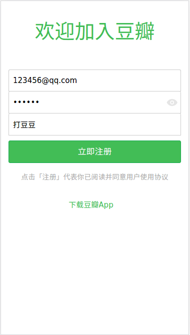

<p align="center">
	
</p>

<br>

<p align="center">
  原项目是由jeneser写的豆瓣demo使用的是vue技术栈，
  地址 https://github.com/jeneser/douban，
  这个项目是使用react技术栈编写
</p>

<p align="center">
douban DEMO created with React + react-router + react-redux + css modules + less + axios
</p>

<p align="center">
    
    
    <br>
     
    
    <br><br>
    <strong>......</strong>
    <br>
	 <strong><a href="https://jeneser.github.io/douban/">Live Demo</a></strong>
</p>

<p align="center">

## Build Setup

``` bash
# install dependencies
npm install

# serve with hot reload at localhost:8080
npm run start

# build for production with minification
npm run build

```